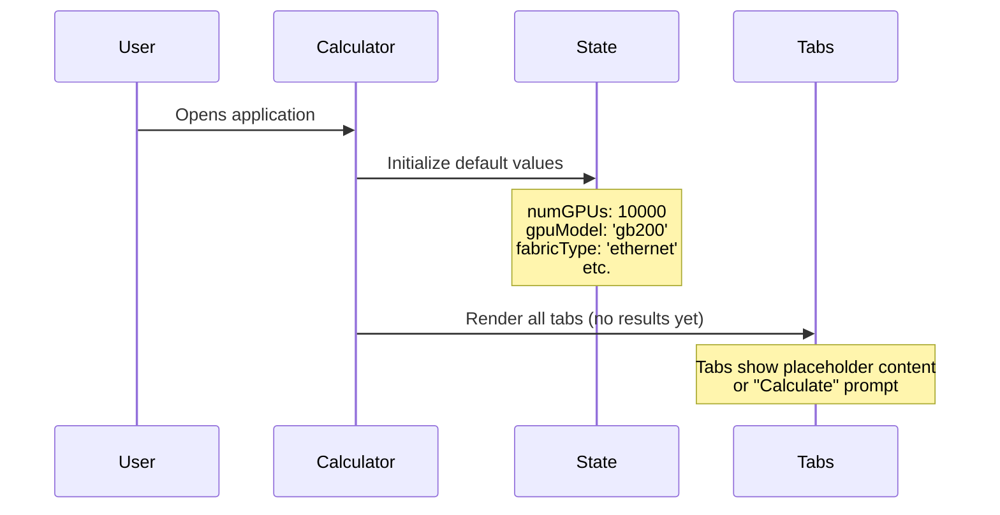
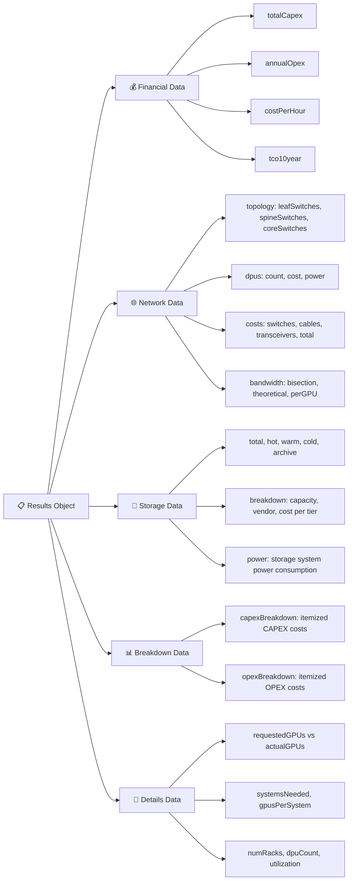
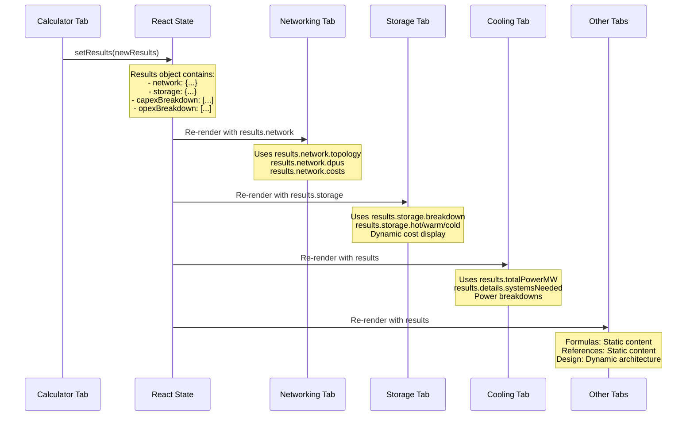

# GPU SuperCluster Calculator - Process Flow Diagram

## 🔄 Complete Data Flow Architecture

```mermaid
graph TD
    A[👤 User Opens Calculator] --> B[📱 Calculator Tab - Main Configuration]
    
    B --> C{🔧 User Modifies Configuration}
    C --> D[📝 State Updates in GPUSuperclusterCalculatorV5Enhanced]
    
    D --> E[⚡ calculate() Function Triggered]
    
    E --> F[🧮 Main Calculation Engine]
    F --> F1[💰 GPU CAPEX Calculation]
    F --> F2[🏗️ Infrastructure Sizing]
    F --> F3[⚡ Power Calculations]
    F --> F4[🌐 Network Cost Calculation]
    F --> F5[💾 Storage Cost Calculation]
    F --> F6[❄️ Cooling Requirements]
    F --> F7[🏢 Data Center Infrastructure]
    F --> F8[💻 Software & Licensing]
    F --> F9[👥 Staffing Calculations]
    F --> F10[📊 OPEX/CAPEX Breakdowns]
    
    F1 --> G[📋 Complete Results Object Created]
    F2 --> G
    F3 --> G
    F4 --> G
    F5 --> G
    F6 --> G
    F7 --> G
    F8 --> G
    F9 --> G
    F10 --> G
    
    G --> H[🔄 setResults() Updates State]
    
    H --> I1[📊 Calculator Tab Updates]
    H --> I2[🌐 Networking Tab Updates]
    H --> I3[💾 Storage Tab Updates]
    H --> I4[❄️ Cooling & Power Tab Updates]
    H --> I5[🧮 Formulas Tab Updates]
    H --> I6[📚 References Tab Updates]
    H --> I7[📐 Design Summary Tab Updates]
    H --> I8[🏗️ Design Exercise Tab Updates]
    
    style A fill:#e1f5fe
    style B fill:#f3e5f5
    style E fill:#fff3e0
    style F fill:#e8f5e8
    style G fill:#fff8e1
    style H fill:#fce4ec
```

## 📋 Detailed Process Flow

### 1. 🚀 **Initial Load & Configuration**



### 2. ⚙️ **User Configuration Process**

```mermaid
flowchart LR
    A[👤 User Input] --> B{📝 Configuration Type}
    
    B -->|GPU Config| C1[🖥️ GPU Model Selection]
    B -->|Infrastructure| C2[🏗️ Number of GPUs]
    B -->|Power| C3[⚡ Cooling Type]
    B -->|Location| C4[🌍 Region Selection]
    B -->|Performance| C5[📈 Utilization Rate]
    B -->|Financial| C6[💰 Depreciation Period]
    B -->|Storage| C7[💾 Storage Configuration]
    B -->|Network| C8[🌐 Fabric Type & Topology]
    B -->|Advanced| C9[⚙️ Override Options]
    
    C1 --> D[🔄 State Update]
    C2 --> D
    C3 --> D
    C4 --> D
    C5 --> D
    C6 --> D
    C7 --> D
    C8 --> D
    C9 --> D
    
    D --> E[⚡ Trigger calculate()]
```

### 3. 🧮 **Core Calculation Engine**

```mermaid
graph TD
    A[⚡ calculate() Function] --> B[🔍 Input Validation]
    
    B --> C[🏗️ System Architecture Calculation]
    C --> C1[📊 systemsNeeded = Math.ceil(numGPUs / spec.rackSize)]
    C --> C2[🖥️ actualGPUs = systemsNeeded × spec.rackSize]
    C --> C3[⚡ rackPowerTotal = systemsNeeded × spec.rackPower]
    
    C --> D[💰 Financial Calculations]
    D --> D1[💵 gpuCapex = gpuUnitPrice × actualGPUs]
    D --> D2[🏢 datacenterCapex = totalPowerMW × 10M]
    D --> D3[❄️ coolingCapex = gpuPowerMW × 400/300]
    D --> D4[💻 softwareCapex = actualGPUs × 6500]
    
    C --> E[🌐 Network Calculations]
    E --> E1[🔌 dpuCount = systemsNeeded × 4 (GB200)]
    E --> E2[🏗️ Pod Architecture: gpusPerPod = 1008/1024]
    E --> E3[🔀 Switch Topology: leaf/spine/core]
    E --> E4[💰 Network Costs: switches + cables + transceivers]
    
    C --> F[💾 Storage Calculations]
    F --> F1[🔥 Hot Tier: totalStorage × hotPercent]
    F --> F2[🌡️ Warm Tier: totalStorage × warmPercent]
    F --> F3[❄️ Cold Tier: totalStorage × coldPercent]
    F --> F4[🗄️ Archive Tier: totalStorage × archivePercent]
    
    D --> G[📊 Results Object Assembly]
    E --> G
    F --> G
    
    G --> H[🔄 setResults(completeResultsObject)]
```

### 4. 📊 **Results Object Structure**



### 5. 🔄 **Dynamic Tab Updates**



### 6. 🎯 **Specific Tab Data Dependencies**

```mermaid
graph TD
    A[📊 Results Object] --> B[📱 Calculator Tab]
    A --> C[🌐 Networking Tab]
    A --> D[💾 Storage Tab]
    A --> E[❄️ Cooling & Power Tab]
    A --> F[📐 Design Summary Tab]
    
    B --> B1[📈 Infrastructure Metrics]
    B --> B2[💰 Cost Breakdowns]
    B --> B3[🏗️ Architecture Breakdown]
    B --> B4[⚠️ System Count Notifications]
    
    C --> C1[results.network.topology]
    C --> C2[results.network.dpus]
    C --> C3[results.network.costs]
    C --> C4[results.network.bandwidth]
    C --> C5[🔄 Falls back to local calc if no results]
    
    D --> D1[results.storage.breakdown]
    D --> D2[results.storage.hot/warm/cold/archive]
    D --> D3[results.storageGbMonth]
    D --> D4[results.breakdown.capex/opex.storage]
    
    E --> E1[results.totalPowerMW]
    E --> E2[config.numGPUs → actualGPUs]
    E --> E3[results.details.systemsNeeded]
    E --> E4[Power consumption breakdowns]
    
    F --> F1[config values for real-time calc]
    F --> F2[Dynamic architecture display]
    F --> F3[Pod topology updates]
```



### 7. 🔧 **Error Handling & Fallbacks**

```mermaid
flowchart TD
    A[🔄 Tab Rendering] --> B{📊 Results Available?}
    
    B -->|✅ Yes| C[📋 Use Results Data]
    B -->|❌ No| D[⚠️ Fallback Behavior]
    
    C --> C1[🌐 Networking: Use results.network]
    C --> C2[💾 Storage: Use results.storage]
    C --> C3[❄️ Cooling: Use results.totalPowerMW]
    
    D --> D1[🌐 Networking: Local calculateNetworkingDetails()]
    D --> D2[💾 Storage: Config-based calculations]
    D --> D3[❄️ Cooling: Basic power estimates]
    D --> D4[📊 Show 'Calculate' prompt]
    
    C1 --> E[✅ Dynamic Content Display]
    C2 --> E
    C3 --> E
    
    D1 --> F[⚠️ Static/Placeholder Content]
    D2 --> F
    D3 --> F
    D4 --> F
```

## 🎯 **Key Process Characteristics**

### ✅ **Real-Time Updates:**
- **Immediate**: State changes trigger instant re-renders
- **Consistent**: All tabs use same underlying data
- **Accurate**: Complete system calculations (no partial systems)

### 🔄 **Data Flow Pattern:**
1. **User Input** → State Update → calculate() → Results Object → Tab Updates
2. **Single Source of Truth**: Main calculator provides all data
3. **Fallback Gracefully**: Tabs work even without results

### 🏗️ **Architecture Benefits:**
- **Maintainable**: Centralized calculation logic
- **Scalable**: Easy to add new tabs or metrics
- **Reliable**: Consistent data across all views
- **Professional**: Real-world procurement constraints

### 🎪 **User Experience:**
- **Responsive**: Instant feedback on configuration changes
- **Comprehensive**: All infrastructure domains covered
- **Accurate**: Based on official design documents
- **Transparent**: Clear assumptions and alternatives

This process flow ensures that every user configuration change immediately propagates through the entire calculator, updating all tabs with consistent, accurate data based on complete system calculations.
