# Sesterce GPU SuperCluster Calculator

A production-grade calculator for designing, costing, and monetizing large-scale GPU clusters (10,000–200,000 GPUs) based on NVIDIA GB200/GB300 NVL72 systems. Features sophisticated networking algorithms, dynamic service tier pricing, and comprehensive TCO analysis with transparent calculation logic.

## 🏗️ Architecture Overview


## 🧮 Core Calculation Engine

### End-to-End Calculation Flow


### System Sizing Logic

```mermaid
flowchart LR
    subgraph "Input Processing"
        A[Requested GPUs] --> B{GPU Model?}
        B -->|GB200/GB300| C[72 GPUs/Rack]
        B -->|H100 SXM| D[8 GPUs/System]
        B -->|H100 PCIe| E[8 GPUs/System]
    end
    
    subgraph "Sizing Calculation"
        C --> F[Systems = ceil(GPUs/72)]
        D --> G[Systems = ceil(GPUs/8)]
        E --> G
        F --> H[Actual GPUs = Systems × 72]
        G --> I[Actual GPUs = Systems × 8]
    end
    
    subgraph "Power Calculation"
        H --> J[GB Power: 120kW/rack]
        I --> K[H100 Power: 6.5kW/system]
        J --> L[Total IT Load]
        K --> L
        L --> M[PUE Application]
        M --> N[Total Facility Power]
    end
```

## 🌐 Networking Architecture Algorithm

### Architecture Selection by Scale

```mermaid
flowchart TD
    A[GPU Count Input] --> B{Scale Analysis}
    B -->|≤ 2,000 GPUs| C[2-Tier Leaf-Spine]
    B -->|2,001-10,000 GPUs| D[3-Tier with Pods]
    B -->|> 10,000 GPUs| E[3-Tier Multi-Pod + Core]
    
    C --> F[Simple Leaf-Spine Fabric]
    D --> G[Pod-based Architecture]
    E --> H[Core-Spine-Leaf Hierarchy]
    
    F --> I[Leaf Switches: ceil(Racks/2)]
    F --> J[Spine Switches: max(6, leafCount/4)]
    
    G --> K[Pods: ceil(GPUs/1008)]
    K --> L[Leaf per Pod: ceil(1008/64)]
    L --> M[Spine per Pod: max(6, leafs×9/128)]
    
    H --> N[Core Groups: ceil(Pods/6)]
    N --> O[Core Switches: Groups×12]
    O --> P[Pod Interconnect Matrix]
```

### Detailed Network Component Sizing

```mermaid
graph TB
    subgraph "Pod Architecture (1,008 GPUs)"
        A[14 Racks × 72 GPUs] --> B[28 Leaf Switches]
        B --> C[Dual-homed ToR]
        C --> D[Rails per GPU: 9]
        D --> E[Spine Requirement]
        E --> F[16 Spine Switches]
        F --> G[N+2 Redundancy]
    end
    
    subgraph "Switch Specifications"
        H[Spectrum-4 400G: 128 ports]
        I[Spectrum-4 800G: 64 ports]
        J[Quantum-3 800G: 144 ports]
    end
    
    subgraph "Cable Calculations"
        K[Intra-Pod: Leaf×Rails×GPUs/Leaf]
        L[Inter-Pod: Core×Spine×Pods]
        M[Total Cables = Intra + Inter]
    end
    
    B --> H
    F --> I
    F --> J
    E --> K
    O --> L
```



### Storage Network Sizing Algorithm

```mermaid
flowchart LR
    subgraph "Training Storage (VAST/WEKA)"
        A[GPUs] --> B[Bandwidth = GPUs/1000 × 1.6 Tbps]
        B --> C[400G Ports = ceil(Bandwidth×1000/400)]
        C --> D[64×400G Switches = ceil(Bandwidth/25.6)]
    end
    
    subgraph "Object Storage (Ceph)"
        E[GPUs] --> F[100G Ports = GPUs/10]
        F --> G[32×100G Switches = ceil(GPUs/320)]
    end
    
    subgraph "Network Integration"
        D --> H[Training Network Fabric]
        G --> I[Object Storage Fabric]
        H --> J[Converged Data Center]
        I --> J
    end
```

## 💰 Service Tier Pricing Model

### Service Tier Distribution Logic


### Revenue Calculation Flow


## 🛠️ Quick Start

### Local Development
```bash
# Frontend
cd sesterce-dashboard
npm install
npm start

# Backend
python3 -m venv venv
source venv/bin/activate
pip install -r requirements.txt
python calculator-api.py
```

### Production Deployment
```bash
# Automated setup
./deploy-secure.sh

# Manual nginx setup
./start-nginx.sh

# Access at http://localhost:3025
```

### Authentication
- **Admin**: `admin` / `Vader@66`
- **Users**: `Youssef` / `Y0da!777`, `Maciej` / `H0th#88!`

---

**© 2025 Sesterce. All rights reserved.**
